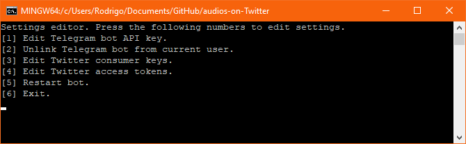

# Audios on Twitter
## Requirements
* Python 3.6.8 (other versions may or may not work). [Get it here for Windows or Mac](https://www.python.org/downloads/release/python-368/). On Linux, check instructions for your distribution.
###### **NOTE:** For Windows, if you get the pre-compiled binary from the [releases page](https://github.com/rogama25/audios-on-Twitter/releases/latest) there's no need to have Python installed.

* FFMPEG.

	**For Windows:** Place the bin/ffmpeg.exe that it's included in the zip that you can download from [here](https://ffmpeg.zeranoe.com/builds/) into the folder where you have the program. *If none is found in the folder, version 4.1.1 will be downloaded. Any newer version should work.*

	**For Mac:** I don't really know how does that OS work. It should work with no problems if the program can run a ffmpeg executable (it should be if it's in the same folder as the program or in paths). *It should be work with the 20190128 version or any newer.*

	**For Linux:** Follow the instructions for your distribution.

### IMPORTANT NOTE: The program should be in a folder with writing permissions. It will save the settings on the folder you place the programs into config.cfg and will download and convert media you send to it on the /media folder and it will delete after the Tweet is sent so it uses a very low space on disk. For Windows, it also downloads ffmpeg into the folder.

## Installation.
**For Windows:** [Get Python](https://www.python.org/downloads/release/python-368/) and download the source code from the [releases page](https://github.com/rogama25/audios-on-Twitter/releases/latest). Then run `pip install -r requirements.txt`. Finally run `py main.py` and follow the instructions on screen to configure it.
Alternatively, get the pre-compiled .exe file on the [releases page](https://github.com/rogama25/audios-on-Twitter/releases/latest) and just run it.

**For Mac or Linux:** Get the requirements that appear on the first section and run `pip install -r requirements.txt` then `py main.py`.

## Changelog
Check the changelog [here](changelog.md) or on the [releases page](https://github.com/rogama25/audios-on-Twitter/releases). It's planned to show the changelog from the program but it's not done yet.

## Usage
The first time you run it, you will be asked to configure it with the following screen: 

There you should add the API keys for Twitter and Telegram.

**1:** Telegram API key for the bot that you have to send the audios to. Get that key by talking to [BotFather](https://t.me/botfather) and creating a new bot.

**2:** This should unlink the program to the Telegram user that is linked to (explanation below)

**3:** Twitter consumer keys (those are related to your application)

**4:** Twitter access tokens (those are related to you account). Get both 3 and 4 [here](https://developer.twitter.com/en.html) and then create a new application with read, write and direct messaging permissions for your account.

**5:** Start the bot, or restart it after you have edited some settings

**6:** Exit the program.

After you have set it up and you start it, the program shows you a 6-digit code that you should send it through Telegram. After you send it, your Telegram account should be linked with the bot and other user accounts shouldn't be able to interact with the bot. Then you just have to send an audio and it will convert to a video and tweet it on your account :D

#### Commands:
* `/text <your text here>`: This adds the text you send to the next Tweet the bot sends. Keep in mind that Twitter doesn't allow more than 240 characters and will be truncated at that length. It will remove the text if no text is sent. *Planned to add link workarounds to limit text at the maximum possible (that should be 280 instead of 240 chars.)*
* `/cancel`: This will cancel replying to a Tweet.
* Send a link to a Tweet and the next audios you send will be sent in reply to this.
* Send an audio and will be tweeted, with some options or another depending on the previous commands. Please keep in mind that the program doesn't remember things after a restart.

## Contributing
Feel free to submit issues or pull requests :D

#### People that contributed to this project (Thanks!):
* [IceWildcat](https://github.com/IceWildcat): Text now ends at the last space before 240 characters.